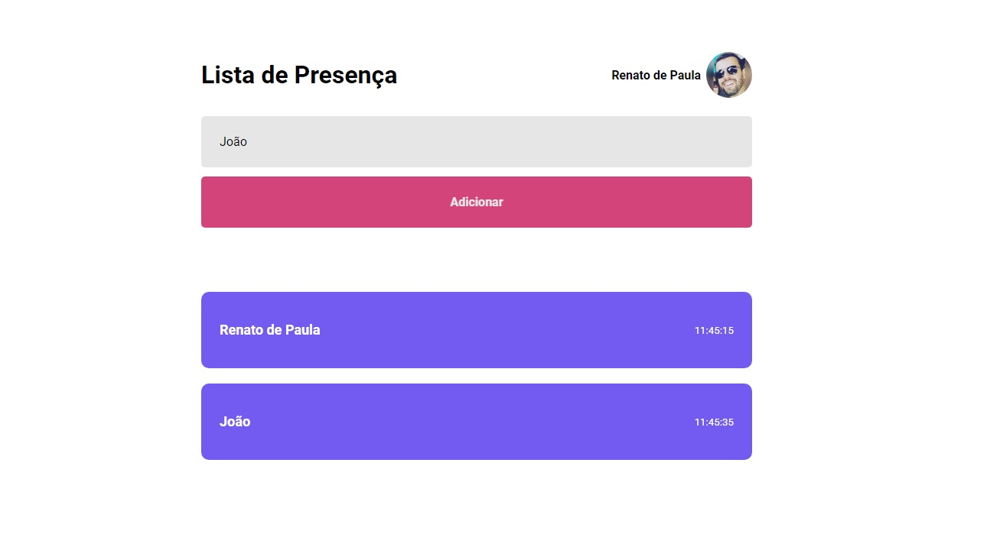

<h1 align="center"> Lista de Presença com TypeScript </h1>

Lista de presença feita utilizando TypeScript

  <a href="#-tecnologias">Tecnologias</a>&nbsp;&nbsp;&nbsp;|&nbsp;&nbsp;&nbsp;
  <a href="#-projeto">Projeto</a>&nbsp;&nbsp;&nbsp;|&nbsp;&nbsp;&nbsp;
  <a href="#-layout">Layout</a>&nbsp;&nbsp;&nbsp;|&nbsp;&nbsp;&nbsp;

 

  

## 🚀 Tecnologias

Esse projeto foi desenvolvido com as seguintes tecnologias:

- HTML e CSS
- JavaScript
- React
- TypeScript
- Git e GitHub

## 💻 Projeto

Projeto de aplicação de lista de presença para adicionar usuário e horário.

---

Feito com ♥ by Rocketseat :wave: [Participe da  comunidade!](https://discord.gg/rocketseat)